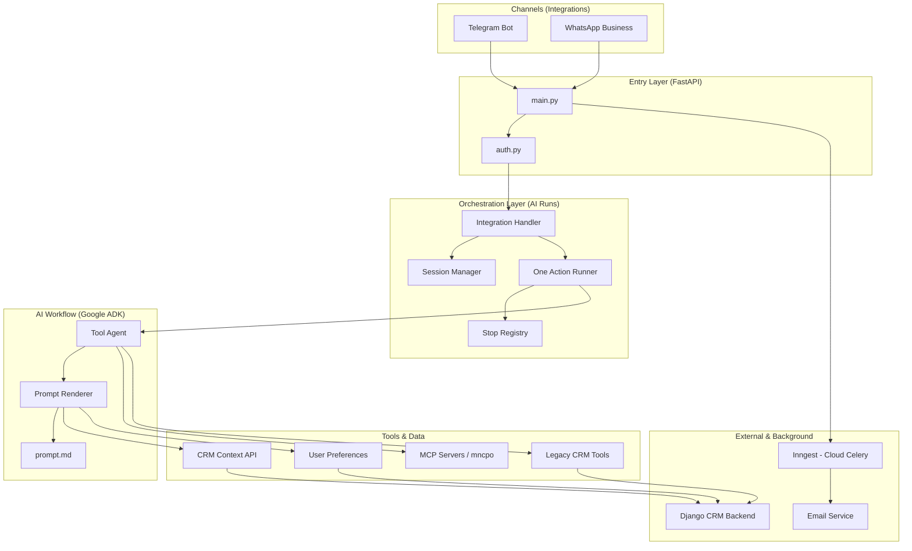
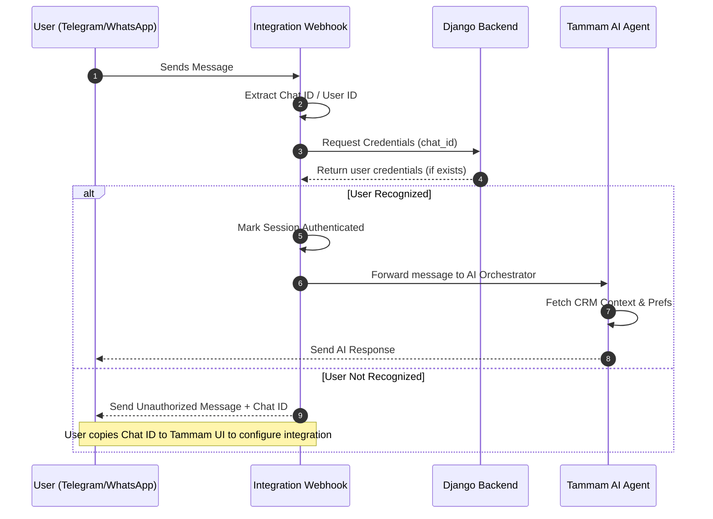

# Tammam AI Service

<p align="center">
  <a href="https://tammam.founderstack.cloud/"><b>Website</b></a> •
  <a href="https://t.me/TammamAgent"><b>Telegram Community</b></a>
</p>

<p align="center">
  <a href="https://t.me/TammamAgent">
    
  </a>
  <a href="https://tammam.founderstack.cloud/">
    
  </a>
  
</p>

FastAPI-based AI Agent.

## Architecture
### better view at [Internal Architecture](https://excalidraw.com/#json=llFQW2Bbe6RDigLRtEjLs,r9AM4xQh2s8xDBMaNpU8iA)



## User Journey & Authentication Flow
### better view at [User Architecture](https://excalidraw.com/#json=BF2gvYOmrXZPqkqE5X-eH,IyQSIdVK6b5X6u8uowP-gA)


## Why Tammam AI?

This service was created to bridge the gap between advanced AI agents and multi-user CRM environments. 

While tools like **OpenClaw** are powerful, they are often difficult to scale for individual users within a platform. Tammam AI is designed as a **multi-user alternative** for those who need to integrate agentic AI into their existing products without spinning up separate instances for every user. It’s "OpenClaw multi-users for the rest of us."

## Authentication & Personalization Workflow

The system is designed to work seamlessly with an existing backend to provide secure, personalized AI experiences.

- **Backend-Driven Auth:** We assume a backend is already managing user integrations. When a message arrives (e.g., from Telegram or WhatsApp), the service validates the sender's Chat ID against the backend. If the user isn't recognized, access is denied.
- **Contextual API Keys:** The backend provides a scoped API key for each user. This key is used for authenticating MCP servers and loading user-specific CRM context directly into the agent's prompt (see `ai/tools/manage_api_key.py`).
- **Dynamic User Preferences:** Personalization is handled by fetching user preferences from the backend and rendering them in the prompt. This ensures the agent adapts to the unique workflow and style of every user (see `ai/tools/usr/prefrence.py`).

## Project Structure

```text
fastai/
├── main.py                     # FastAPI entry point & API endpoint definitions
├── auth.py                     # Authentication utilities
├── inngest_client.py           # Background Jobs ("Cloud Celery") - handles schedules & queues
├── Dockerfile                  # Container configuration
│
├── ai/                         # THE BRAIN: AI Orchestration & Google ADK bridge
│   ├── runs/                   # The Bridge: integration routing & session management
│   │   ├── integration_handler.py # Routes messages from UI to the correct agent
│   │   ├── one_action.py       # Core runner for single agent actions (retries, error handling)
│   │   ├── session_manager.py     # Manages user sessions and state
│   │   └── stop_registry.py       # Handles cancellation/stopping of active agent runs
│   │
│   ├── tools/                  # Config & Legacy: CRM context & personalization
│   │   ├── manage_api_key.py      # Fetches/injects CRM context from backend into prompts
│   │   ├── usr/prefrence.py   # Loads user-specific preferences for personalization
│   │   └── crm/                # Deprecated toolsets (kept for reference, moved to MCP)
│   │
│   ├── workflows/              # Agents & Prompts: Actual agent implementations
│   │   ├── g_adk/              # Primary production agent (Google ADK)
│   │   │   └── tool_agent/
│   │   │       ├── agent.py    # Agent definition and tool binding
│   │   │       ├── helpers.py  # Prompt rendering & data injection
│   │   │       └── prompt.md   # The main "System Instruction" for the production agent
│   │   │
│   │   ├── manager/            # (In Dev) Future Manager/Sub-agent architecture
│   │   ├── utils/msg_stt.py    # Scenario helper: Audio (STT) conversion before agent processing
│   │   └── tests/              # some tests
│   │
│   └── utils/                  # Shared AI utilities (logging, prompt management, etc.)
│
├── integrations/               # USER CHANNELS: How users talk to the agent
│   ├── telegram/               # Full Telegram bot integration
│   │   ├── webhook.py          # Receives incoming Telegram messages
│   │   ├── handlers.py         # Routes commands and messages to the agent
│   │   ├── utils.py            # Typing indicators, markdown, & auth utils
│   │   ├── credentials.py      # Secure token & integration ID management
│   │   ├── set_webhook.py      # Configuration script for Telegram API
│   │   └── test_markdown.py    # Utility for verifying markdown conversion
│   │
│   ├── whatsapp/               # WhatsApp Business API integration
│   │   ├── client.py           # Handles communication with WhatsApp API
│   │   ├── handlers.py         # Processes incoming WhatsApp events
│   │   ├── utils.py            # Formatting & validation helpers
│   │   └── credentials.py      # Access token & business ID management
│   │
│   └── send_message_auth.py    # Ensures outgoing messages are authenticated & routed correctly
│
├── services/                   # SPECIALIZED TASKS: Stand-alone AI scripts & on-demand services
│   ├── email_service.py        # Handles email sending & templates
│   ├── llm.py                  # Base LLM utilities
│   └── conversation_parser.py  # One-off parsing tasks (non-agentic)
│
└── helpers/                    # UTILITY SCRIPTS: Data transformation & helper logic
    └── toon.py                 # DEPRICATED: we will be using the "toon" pkg directly
```

## Deep Dive: Core Modules

### 🧠 AI Production Agent (`ai/workflows/g_adk/`)
The primary agent powered by the Google Agent Development Kit (ADK).
*   **`README.md`**: Provides specific documentation and setup instructions for the Google ADK workflow.
*   **`tool_agent/agent.py`**: The main entry point for the production agent. It binds the LLM with its tools and instructions.
*   **`tool_agent/prompt.md`**: The master system instruction. It contains the personality, rules, and placeholders for dynamic data.
*   **`tool_agent/helpers.py`**: A crucial script that "renders" the prompt. It fetches data like CRM pipeline stages, lead types, and user communication styles, then injects them into `prompt.md` before the agent starts.

### ✈️ Telegram Integration (`integrations/telegram/`)
Handles all communication between the AI and Telegram users.
*   **`webhook.py`**: The entry point for Telegram's API. It receives updates and passes them to the handler.
*   **`handlers.py`**: Contains the logic for processing different message types (text, voice, commands). It's responsible for calling the AI and sending back the response.
*   **`utils.py`**: A powerhouse of utilities:
    *   **Typing Indicators**: Keeps the "Agent is typing..." state active while the AI thinks.
    *   **Markdown Conversion**: Converts complex AI markdown into Telegram-safe HTML.
    *   **Credential Validation**: Checks with the CRM backend to see if the user is authorized and has active credits.
*   **`credentials.py`**: Handles secure fetching of Bot tokens and user-specific integration IDs from the Django backend.
*   **`set_webhook.py`**: A one-time setup script to register your server URL with Telegram.

### 💬 WhatsApp Integration (`integrations/whatsapp/`)
Manages the connection with the WhatsApp Business API.
*   **`client.py`**: The low-level client that handles the actual HTTP requests to the WhatsApp Business API.
*   **`handlers.py`**: Listens for incoming WhatsApp messages and status updates (like message read receipts).
*   **`utils.py`**: Formatting and validation helpers specific to WhatsApp's messaging constraints.
*   **`credentials.py`**: Manages the WhatsApp access tokens and business account IDs.

## API Endpoints

### DEPRICATED endpoints
- `POST /ai/process-lead` - Process a lead
- `POST /ai/parse-conversation` - Parse conversation to fields
- `POST /trigger/activity-log` - Trigger AI recommendation

### Background Triggers
- `POST /trigger/send-email` - Queue email sending

### Integration Webhooks (TODO)
- `POST /integrations/telegram/webhook`
- `POST /integrations/whatsapp/webhook`

## Development

### Adding a New Agent (Workflow)
1. Create a new directory in `ai/workflows/`
2. Follow the Google ADK structure (see `ai/workflows/g_adk/README.md` for details)
3. Define your `agent.py` and `prompt.md`
4. Register the agent runner in `ai/runs/` if necessary

### Adding a New Tool
- **MCP Servers:** Modern tools should be implemented as separate MCP (Model Context Protocol) servers.
- **Legacy/Config Tools:** Add new configuration fetchers or specialized toolsets in `ai/tools/`.

### Adding a New Integration
1. Create a new module in `integrations/`
2. Implement handlers for the specific platform (Telegram, WhatsApp, etc.)
3. Add the webhook endpoint in `main.py` and ensure authentication via `auth.py`

### Background Tasks
- Register new tasks or scheduled functions in `inngest_client.py`.

## Environment Variables

See `env.example` for configuration
